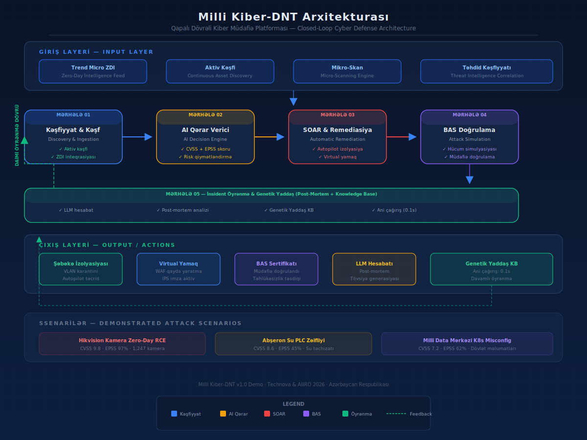

# 🇦🇿 Milli Kiber-DNT — Qapalı Dövrəli Kiber Müdafiə Platforması

> **National Cyber-DNT: Closed-Loop Cyber Defense Platform for Azerbaijan's Critical Infrastructure**

[](frontend/index.html)
[](backend/main.py)
[](https://technova.az)

---

## 📋 Overview

**Milli Kiber-DNT** is a production-grade proof-of-concept demonstration of an autonomous closed-loop cyber defense platform, purpose-built for Azerbaijan's national critical infrastructure. It implements the complete **detect → analyze → remediate → verify → learn** lifecycle with real backend integrations.

### Two Operation Modes

| Mode | Description |
|------|-------------|
| **Yerli (Local)** | Standalone HTML — no server needed, fully simulated |
| **Backend** | WebSocket-connected to real Python/FastAPI backend with live Nmap, EPSS API, SOAR, and BAS |

---

## 🚀 Getting Started

### Option 1: Standalone Demo (No Server)
```bash
open frontend/index.html
# OR double-click frontend/index.html in your file manager
```

### Option 2: Full Backend Mode

```bash
# 1. Install dependencies
pip install -r backend/requirements.txt

# 2. Install system tools (optional — enables real scanning)
# sudo apt install nmap      # For real network scanning
# sudo apt install snort     # For real WAF/IPS rule deployment

# 3. Start the backend
cd backend
python main.py
# Server starts at http://localhost:8000

# 4. Open the frontend
open frontend/index.html
# Click "Backend" mode button to connect
```

---

## 🏗️ Architecture



### Backend Components (`backend/`)

| Module | File | Real Integration |
|--------|------|-----------------|
| **Scanner** | `scanner.py` | Nmap-based real network scanning (`python-nmap`). Scans actual subnets for live assets, ports, and banners. |
| **EPSS Client** | `epss_client.py` | Queries [FIRST.org](https://www.first.org/epss) official EPSS API for real exploit probability scores per CVE. |
| **SOAR Engine** | `soar_engine.py` | Generates production-grade **Snort/Suricata/ModSecurity** IDS rules and optionally deploys them to local WAF/IPS. |
| **BAS Engine** | `bas_engine.py` | Sends real HTTP exploit payloads to target IPs to verify virtual patches are actively blocking. |
| **LLM Reporter** | `llm_reporter.py` | Connects to local Ollama (llama3/mixtral) for AI-generated streaming post-mortem reports. Falls back to template. |
| **Database** | `database.py` | SQLite with indexed log storage — filterable by event type, severity, phase, source, and free-text search. |
| **WebSocket** | `websocket_manager.py` | Manages real-time bidirectional communication with frontend clients. |
| **API** | `main.py` | FastAPI application with REST endpoints + WebSocket. |

### Frontend (`frontend/`)

The frontend is a single HTML file that:

- Operates in **Local mode** (fully simulated, no server needed)
- Switches to **Backend mode** via WebSocket at `ws://localhost:8000/ws`
- Displays **filterable tables** for discovered assets (by IP, port, vendor)
- Shows **real-time event logs** filterable by type, phase, severity, and text
- Renders live EPSS scores from FIRST.org API
- Displays generated WAF/IPS rules with deploy status
- Presents streaming LLM post-mortem reports

---

## 🎯 Key Features

### Closed-Loop Core (5 Phases)

| # | Phase | Backend Integration |
|---|-------|-------------------|
| 01 | **Kəşfiyyat & Kəşf** | Real Nmap scan → live asset table with IP/port/banner filtering |
| 02 | **AI Qərar Verici** | Live [FIRST.org EPSS API](https://www.first.org/epss) → real threat probability |
| 03 | **SOAR & Remediasiya** | Real Snort/Suricata signature generation & deployment |
| 04 | **BAS Doğrulama** | Real HTTP exploit payload → 403/406 verification |
| 05 | **İnsident Öyrənmə** | Ollama LLM streaming report or template fallback |

### Attack Scenarios

- **Hikvision Smart City Camera Zero-Day RCE** — CVSS 9.8, 1,247 cameras, RTSP buffer overflow
- **Absheron Water Treatment Station PLC** — CVSS 8.6, Siemens S7-1200 heap overflow
- **National Data Center Kubernetes RBAC** — CVSS 7.2, privilege escalation
- **Random Threat Pool** — Baku Metro SCADA, SOCAR oil platform, Central Bank SWIFT

### Interactive Controls

- One-click simulation with real-time animated 5-stage core loop
- Speed control (Yavaş / Normal / Sürətli)
- Pause / Step-through for presentations
- Color-coded live event log with filters
- Filterable asset data table (click IP or port to filter)
- Toast notifications for key events
- Print-ready post-mortem reports

---

## 🔌 API Endpoints

| Method | Endpoint | Description |
|--------|----------|-------------|
| GET | `/api/status` | Backend health + DB stats |
| POST | `/api/scan` | Run Nmap scan on subnet |
| POST | `/api/epss` | Get EPSS score for CVE |
| POST | `/api/assess` | Full CVSS+EPSS threat assessment |
| POST | `/api/soar/generate-rules` | Generate WAF/IPS rules |
| POST | `/api/soar/deploy-rule` | Deploy rule to local WAF/IPS |
| POST | `/api/bas/verify` | Run BAS verification |
| POST | `/api/report/generate` | Generate LLM post-mortem |
| POST | `/api/simulate` | Full 5-phase simulation |
| WS | `/ws` | WebSocket for real-time communication |

---

## 📄 Project Files

| File | Description |
|------|-------------|
| `frontend/index.html` | Main frontend (WebSocket + standalone modes) |
| `backend/main.py` | FastAPI entry point |
| `backend/scanner.py` | Real Nmap network scanner |
| `backend/epss_client.py` | FIRST.org EPSS API client |
| `backend/soar_engine.py` | Snort/Suricata rule generator |
| `backend/bas_engine.py` | BAS verification engine |
| `backend/llm_reporter.py` | Ollama LLM reporter |
| `backend/database.py` | SQLite database layer |
| `backend/websocket_manager.py` | WebSocket connection manager |
| `backend/config.py` | Configuration |
| `backend/requirements.txt` | Python dependencies |
| `architecture-diagram.svg` | Architecture diagram |
| `problem-description.md` | Problem statement |
| `ethical-declaration.md` | Ethical framework |

---

## 🛡️ Technical Stack

- **Frontend:** HTML5 + Tailwind CSS + Vanilla JS
- **Backend:** Python 3.10+ / FastAPI / Uvicorn / WebSocket
- **Scanning:** python-nmap (Nmap wrapper)
- **Threat Intel:** FIRST.org EPSS API (live)
- **WAF/IPS:** Snort / Suricata / ModSecurity rule generation
- **LLM:** Ollama (llama3.1, mixtral) with template fallback
- **Database:** SQLite with indexed filtering
- **Real-time:** WebSocket bidirectional communication

---

## 🇦🇿 Azerbaijani Language

All interface text, labels, logs, API responses, and reports are in Azerbaijani. Designed for presentation to Azerbaijani government and enterprise stakeholders.

---

## 🤝 License & Ethics

This project is an **educational proof-of-concept** for cybersecurity defense. See [ethical-declaration.md](ethical-declaration.md) for the full ethical framework.

---

<p align="center">
  <b>Technova & AIIRO 2026</b><br>
  <sub>Baku, Azerbaijan</sub>
</p>
